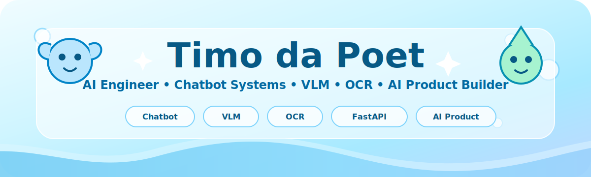
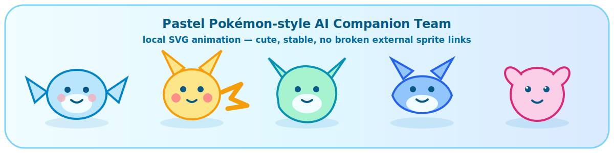
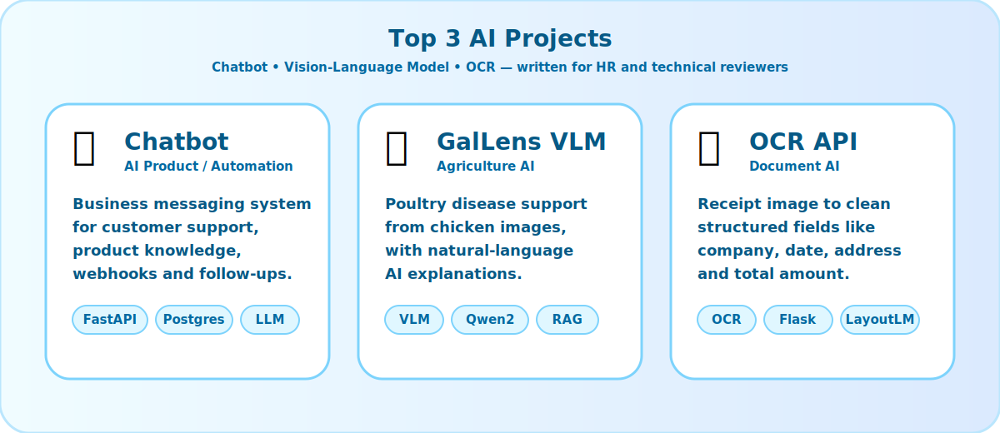
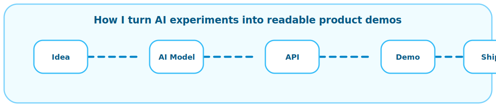

<!--
  GitHub Profile README
  User: tungtimo0808
  Final theme: Pastel Ocean + Pokemon-inspired + HR-friendly AI portfolio
  Stable version: local SVG assets, no broken dynamic repo-card images.
-->

<div align="center">



<br/>



<br/>

<a href="https://github.com/tungtimo0808">
  
</a>
<a href="https://github.com/tungtimo0808?tab=repositories">
  
</a>
<a href="mailto:keytwelvelab@gmail.com">
  
</a>

</div>

---

## 👋 About Me

I am an **AI Engineer** focused on building practical AI products: **Chatbot Systems**, **Vision-Language Models**, **OCR / Document AI**, **Automation**, and **Applied Machine Learning**.

My projects are written so that **HR can understand the product value**, while technical reviewers can still see the engineering direction: API, database, webhook, scheduler, model evaluation, deployment mindset, and clean documentation.

<table>
<tr>
<td width="33%" align="center">

### 🤖 AI Product

Chatbots, automation, APIs, webhook flows, customer data, admin dashboard thinking.

</td>
<td width="33%" align="center">

### 👁️ Vision AI

Vision-Language Models, OCR, document extraction, visual diagnosis support.

</td>
<td width="33%" align="center">

### 🚀 Product Builder

From AI experiments to readable demos, business workflows, and deploy-ready structure.

</td>
</tr>
</table>

---


# ⭐ Featured Projects

<div align="center">



</div>

The top projects are ordered intentionally: **Chatbot → VLM → OCR**.  
These represent my strongest AI product direction and are the easiest for HR to understand.

---

## 🤖 01 — AI Chatbot & Automation System

> **Main AI product direction:** customer support, business messaging, product knowledge, and follow-up automation.

| Category | Details |
|---|---|
| **Project type** | AI chatbot backend / business automation system |
| **Main value** | Turns AI chat into a real business workflow, not just a simple chat demo |
| **Best for** | Customer support, social commerce, sales operations, product FAQ automation |
| **Business impact** | Faster replies, more consistent answers, automated follow-up, better customer data usage |

### HR-friendly explanation

This project shows that I can build **AI product infrastructure** around real customer conversations.  
It combines chatbot logic, API design, database storage, webhook handling, page/product configuration, scheduled follow-ups, and integration with business messaging platforms.

### What this demonstrates

- Building chatbot systems around real business workflows
- Connecting AI replies with product knowledge and page-specific prompts
- Designing backend APIs for admin control and automation
- Handling webhook-based integrations
- Using scheduled jobs for follow-up workflows
- Thinking about deployment, logging, maintainability, and scale

### Stack / skills

`Python` • `FastAPI` • `PostgreSQL` • `Gemini API` • `Webhooks` • `Schedulers` • `Cloudflare R2` • `Business Automation` • `API Design`

---

## 👁️ 02 — GalLens: Vision-Language System for Poultry Disease Diagnosis

**Repository:** [Vision-Language-Model](https://github.com/tungtimo0808/Vision-Language-Model)

| Category | Details |
|---|---|
| **Project type** | Vision-Language Model / Agriculture AI |
| **Main value** | Helps users understand poultry disease signs from chicken images |
| **Best for** | Farmers, agriculture technology, AI-assisted visual diagnosis |
| **Business/social impact** | Makes AI diagnosis support easier to understand for non-technical users |

### HR-friendly explanation

This project applies multimodal AI to a practical agriculture problem.  
Instead of only predicting a label, the system is designed to connect **image understanding** with **natural-language explanation**, so the output is easier for users to trust and act on.

### What this demonstrates

- Applying Vision-Language Models to real-world image understanding
- Building AI that explains visual results in human-readable language
- Working with domain-specific use cases, not generic demo data only
- Understanding the value of knowledge support for safer explanations
- Presenting AI results clearly for both technical and non-technical audiences

### Stack / skills

`Python` • `Vision-Language Model` • `Qwen2-VL` • `LoRA` • `RAG` • `FastAPI` • `Agriculture AI` • `Model Evaluation`

---

## 📄 03 — Receipt Information Extraction API

**Repository:** [OCR-using-SROIE-](https://github.com/tungtimo0808/OCR-using-SROIE-)

| Category | Details |
|---|---|
| **Project type** | OCR / Receipt information extraction |
| **Main value** | Converts receipt images into structured business fields |
| **Best for** | Accounting, retail, finance, expense management, invoice automation |
| **Business impact** | Reduces manual data entry and makes scanned documents usable by software |

### HR-friendly explanation

This project shows practical OCR and information extraction ability.  
It focuses on a business problem that is easy to understand: reading receipts and converting messy document images into clean fields such as **company**, **date**, **address**, and **total**.

### What this demonstrates

- OCR pipeline thinking
- Document understanding and structured extraction
- Practical API/web interface direction
- Evaluation awareness through accuracy and error metrics
- Business-oriented AI automation

### Stack / skills

`Python` • `OCR` • `Flask` • `TrOCR` • `LayoutLMv3` • `SROIE Dataset` • `Document AI` • `Information Extraction`

---


# 🧭 More Projects

<table>
<tr>
<td width="50%">

## 🧩 AIECOS Social CRM

**Repository:** [aiecos-social-crm](https://github.com/tungtimo0808/aiecos-social-crm)

A social CRM template that syncs conversations from social channels into a structured customer database, provides an admin UI, and exposes customer data to AI agents.

**Shows:** product thinking, CRM automation, Supabase/Postgres, admin dashboard, MCP, multi-channel data sync.

</td>
<td width="50%">

## 🎬 Video AI / Focused Video Extraction

**Repository:** [Generate_Video-](https://github.com/tungtimo0808/Generate_Video-)

A creative AI/video processing project focused on extracting or generating a new video around one person and one product.

**Shows:** video AI direction, creative automation, product demo thinking.

</td>
</tr>
<tr>
<td width="50%">

## 🫀 Heart Failure Prediction

**Repository:** [Heart-Failure-Prediction](https://github.com/tungtimo0808/Heart-Failure-Prediction)

A healthcare machine learning project for predicting heart failure risk from structured medical data.

**Shows:** data preprocessing, ML modeling, evaluation, notebook experimentation.

</td>
<td width="50%">

## 🏠 House Price Prediction

**Repository:** [Project-House-Price-Prediction](https://github.com/tungtimo0808/Project-House-Price-Prediction)

A regression machine learning project for predicting house prices from structured features.

**Shows:** feature engineering, model comparison, practical supervised learning.

</td>
</tr>
<tr>
<td width="50%">

## 🍜 Food Recommendation

**Repository:** [Project-Food-Recommendation](https://github.com/tungtimo0808/Project-Food-Recommendation)

A recommendation-system project for suggesting food options from user or item data.

**Shows:** personalization, ranking logic, recommender-system basics.

</td>
<td width="50%">

## 🛡️ Deepfake Detector

**Repository:** [Deepfake-Detector](https://github.com/tungtimo0808/Deepfake-Detector)

An AI safety project focused on detecting manipulated or deepfake media.

**Shows:** responsible AI direction, computer vision, media authenticity.

</td>
</tr>
</table>

---


# 🐚 Project Pokédex

| Dex | Project | Type | HR-friendly value |
|---:|---|---|---|
| #001 | **AI Chatbot & Automation System** | 🤖 AI Product | Customer messaging automation, product knowledge, follow-up workflow, business AI backend |
| #002 | [Vision-Language-Model](https://github.com/tungtimo0808/Vision-Language-Model) | 👁️ VLM / Agriculture AI | Chicken disease support from image + explanation |
| #003 | [OCR-using-SROIE-](https://github.com/tungtimo0808/OCR-using-SROIE-) | 📄 OCR / Document AI | Receipt image → structured fields for business automation |
| #004 | [aiecos-social-crm](https://github.com/tungtimo0808/aiecos-social-crm) | 🧩 AI CRM | Social-channel CRM sync + admin UI + MCP server |
| #005 | [Generate_Video-](https://github.com/tungtimo0808/Generate_Video-) | 🎬 Video AI | Focused video extraction around person/product |
| #006 | [Deepfake-Detector](https://github.com/tungtimo0808/Deepfake-Detector) | 🛡️ AI Safety | Deepfake/media authenticity detection direction |
| #007 | [Heart-Failure-Prediction](https://github.com/tungtimo0808/Heart-Failure-Prediction) | 🫀 Healthcare ML | Predictive modeling for healthcare data |
| #008 | [Project-House-Price-Prediction](https://github.com/tungtimo0808/Project-House-Price-Prediction) | 🏠 Regression ML | House price prediction project |
| #009 | [Project-Food-Recommendation](https://github.com/tungtimo0808/Project-Food-Recommendation) | 🍜 Recommender | Food recommendation system |
| #010 | [medicine-final](https://github.com/tungtimo0808/medicine-final) | 💊 Medical AI | Medicine-related AI/ML project |
| #011 | [mlmed2026](https://github.com/tungtimo0808/mlmed2026) | 🧪 Medical ML | Machine learning in medicine study repo |

---

# 🧬 Skills

<table>
<tr>
<td width="33%" align="center">

## AI / ML

`Machine Learning`  
`Deep Learning`  
`Computer Vision`  
`Vision-Language Models`  
`OCR`  
`RAG`

</td>
<td width="33%" align="center">

## Backend

`Python`  
`FastAPI`  
`Flask`  
`PostgreSQL`  
`Supabase`  
`REST API`

</td>
<td width="33%" align="center">

## Product

`AI Chatbot`  
`Customer Automation`  
`Document AI`  
`CRM Automation`  
`Video AI`  
`Deployable Demo`

</td>
</tr>
</table>

<div align="center">



</div>

---

# 🎮 Current Quest Board

| Main quests | Side quests |
|---|---|
| Build stronger AI chatbot automation systems | Improve README storytelling |
| Improve VLM projects into clear product demos | Make demos cleaner for HR |
| Make OCR/document AI more production-friendly | Improve API documentation |
| Turn AI experiments into deployable tools | Polish UI and deployment structure |
| Keep GitHub readable and professional | Add more real project screenshots |

---

# 🧊 Repository Map

<details open>
<summary><b>Open the Pastel Ocean Project Map</b></summary>

```txt
tungtimo0808/
├── 01_AI_Product
│   ├── AI Chatbot & Automation System     # private / production-style
│   └── aiecos-social-crm                  # social CRM + MCP + Supabase
│
├── 02_Vision_AI
│   ├── Vision-Language-Model              # GalLens poultry disease support
│   ├── OCR-using-SROIE-                   # receipt extraction API
│   └── Deepfake-Detector                  # AI safety direction
│
├── 03_Creative_AI
│   ├── Generate_Video-                    # focused video extraction
│   └── generate-video-                    # video generation workflow
│
└── 04_Machine_Learning
    ├── Heart-Failure-Prediction
    ├── Project-House-Price-Prediction
    ├── Project-Food-Recommendation
    ├── medicine-final
    └── mlmed2026
```

</details>

---

<div align="center">


### Thanks for visiting my Pastel Ocean AI Lab 🌊

**Cute outside. Serious AI engineering inside.**

</div>
