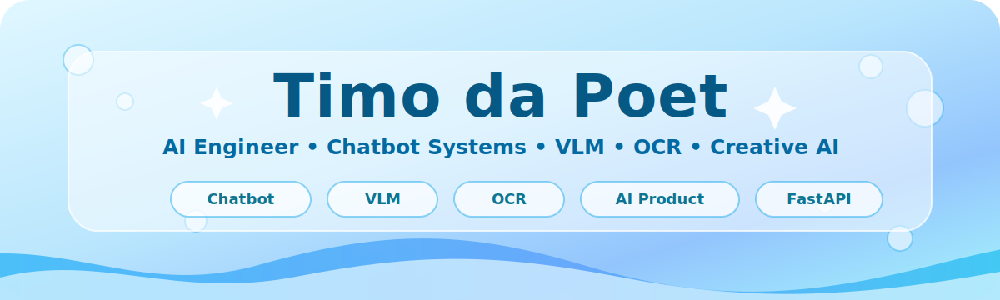
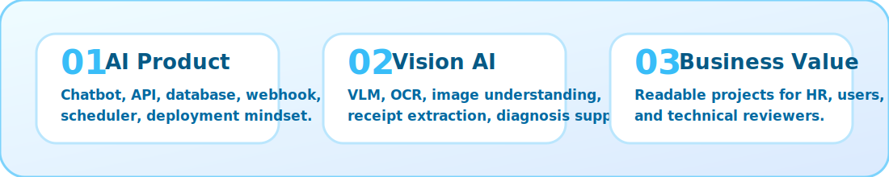

<!--
  GitHub Profile README for: tungtimo0808
  Theme: Pastel Ocean / Cute Pokemon-inspired / HR-friendly AI Engineer profile
  This version avoids fragile dynamic repo-card images to prevent broken image icons.
-->

<div align="center">



<br/>


<br/><br/>


<br/>

<a href="https://github.com/tungtimo0808">
  
</a>
<a href="https://github.com/tungtimo0808?tab=repositories">
  
</a>
<a href="mailto:keytwelvelab@gmail.com">
  
</a>

</div>

---

## 👋 About Me

I am an **AI Engineer** focused on building practical AI products: **Chatbot Systems**, **Vision-Language Models**, **OCR / Document AI**, **Automation**, and **Applied Machine Learning**.

I care about projects that are easy for HR to understand, useful for real users, and clear enough for technical reviewers to inspect.  
My goal is not only to train models, but to turn AI ideas into usable systems with APIs, data storage, dashboards, and deployment-ready structure.



---


# ⭐ Featured Projects

The first three projects are placed at the top because they best represent my current AI direction: **Chatbot**, **VLM**, and **OCR**.

---

## 🤖 01 — AI Chatbot & Automation System

> **Main AI product direction — customer support, business messaging, product knowledge, and follow-up automation.**

| Category | Details |
|---|---|
| **Project type** | AI chatbot backend / business automation system |
| **Goal** | Help businesses manage conversations, automate customer replies, configure knowledge, and trigger follow-up workflows |
| **Best for** | Customer support, social commerce, sales operations, product FAQ automation |
| **Core value** | Turns AI chat into a real business workflow instead of a simple demo chatbot |

### HR-friendly summary

This project shows my ability to build **AI product infrastructure**, not only model experiments.  
It combines chatbot logic, API design, database storage, webhook handling, product/page configuration, scheduled follow-ups, and integration with customer conversation platforms.

### What this demonstrates

- Building chatbot systems around real customer conversations
- Connecting AI replies with product knowledge and page-specific configuration
- Designing backend APIs for admin control and automation
- Using scheduler jobs for follow-up workflows
- Thinking about deployment, logging, and maintainability
- Turning LLM capability into practical business software

### Stack / skills

`Python` • `FastAPI` • `PostgreSQL` • `Gemini API` • `Webhooks` • `Schedulers` • `Cloudflare R2` • `Business Automation` • `API Design`

---

## 👁️ 02 — GalLens: Vision-Language System for Poultry Disease Diagnosis

> **Vision-Language AI project that helps identify poultry diseases from chicken images and explain the result in natural language.**

**Repository:** [Vision-Language-Model](https://github.com/tungtimo0808/Vision-Language-Model)

| Category | Details |
|---|---|
| **Project type** | Vision-Language Model / Agriculture AI |
| **Goal** | Support poultry disease diagnosis from images |
| **Best for** | Farmers, agriculture technology, AI-assisted visual diagnosis |
| **Core value** | Converts visual symptoms into understandable AI explanations |

### HR-friendly summary

This project applies multimodal AI to a practical agriculture problem.  
Instead of only predicting a label from an image, the system is designed to help users understand the diagnosis through natural-language explanation.

### What this demonstrates

- Applying Vision-Language Models to real-world image understanding
- Building AI that explains results in human-readable language
- Working with domain-specific use cases, not generic demo data only
- Understanding the value of RAG / knowledge support for safer explanation
- Creating a project that can be presented to both technical and non-technical audiences

### Stack / skills

`Python` • `Vision-Language Model` • `Qwen2-VL` • `LoRA` • `RAG` • `FastAPI` • `Agriculture AI` • `Model Evaluation`

---

## 📄 03 — Receipt Information Extraction API

> **Document AI project that turns receipt images into structured business data.**

**Repository:** [OCR-using-SROIE-](https://github.com/tungtimo0808/OCR-using-SROIE-)

| Category | Details |
|---|---|
| **Project type** | OCR / Receipt information extraction |
| **Goal** | Extract fields such as company, date, address, and total from receipt images |
| **Best for** | Accounting, retail, finance, expense management, invoice automation |
| **Core value** | Reduces manual data entry by converting images into structured data |

### HR-friendly summary

This project shows practical OCR and information extraction ability.  
It focuses on a business problem that is easy to understand: reading receipts and converting messy document images into clean fields that software can use.

### What this demonstrates

- OCR pipeline thinking
- Document understanding and structured extraction
- Practical API/web interface direction
- Evaluation awareness through accuracy and error metrics
- Business-oriented AI automation

### Stack / skills

`Python` • `OCR` • `Flask` • `TrOCR` • `LayoutLMv3` • `SROIE Dataset` • `Document AI` • `Information Extraction`

---


# 🧭 More Project Cards

## 🧩 AIECOS Social CRM

**Repository:** [aiecos-social-crm](https://github.com/tungtimo0808/aiecos-social-crm)

| Category | Details |
|---|---|
| **Project type** | Social CRM / AI agent-ready customer system |
| **Goal** | Sync conversations from social channels into a structured customer database |
| **Best for** | Sales teams, social commerce, customer care, AI agent workflows |
| **Core value** | Makes customer data easier to manage, search, and use with AI agents |

**Shows:** product thinking, CRM automation, Supabase/Postgres, admin dashboard, MCP, multi-channel data sync.

---

## 🎬 Video AI / Focused Video Extraction

**Repository:** [Generate_Video-](https://github.com/tungtimo0808/Generate_Video-)

| Category | Details |
|---|---|
| **Project type** | Creative AI / video processing |
| **Goal** | Generate or extract a new focused video around one person and one product |
| **Best for** | Short-form content, product clips, automation tools |
| **Core value** | Turns raw video into more focused content for presentation or marketing |

**Shows:** video AI direction, creative automation, product demo thinking.

---

## 🫀 Heart Failure Prediction

**Repository:** [Heart-Failure-Prediction](https://github.com/tungtimo0808/Heart-Failure-Prediction)

| Category | Details |
|---|---|
| **Project type** | Healthcare machine learning |
| **Goal** | Predict heart failure risk from structured medical data |
| **Best for** | Healthcare ML practice, tabular prediction, model evaluation |
| **Core value** | Demonstrates classic ML workflow on a medically relevant dataset |

**Shows:** data preprocessing, ML modeling, evaluation, notebook experimentation.

---

## 🏠 House Price Prediction

**Repository:** [Project-House-Price-Prediction](https://github.com/tungtimo0808/Project-House-Price-Prediction)

| Category | Details |
|---|---|
| **Project type** | Regression ML |
| **Goal** | Predict house prices from structured features |
| **Best for** | Practical regression practice, feature engineering, baseline modeling |
| **Core value** | Shows understanding of classic supervised learning problems |

---

## 🍜 Food Recommendation

**Repository:** [Project-Food-Recommendation](https://github.com/tungtimo0808/Project-Food-Recommendation)

| Category | Details |
|---|---|
| **Project type** | Recommendation system |
| **Goal** | Recommend food options based on user or item data |
| **Best for** | Recommender-system basics, personalization, ranking logic |
| **Core value** | Shows ability to frame user preference problems as ML/product tasks |

---

## 🛡️ Deepfake Detector

**Repository:** [Deepfake-Detector](https://github.com/tungtimo0808/Deepfake-Detector)

| Category | Details |
|---|---|
| **Project type** | AI safety / media authenticity |
| **Goal** | Detect manipulated or deepfake media |
| **Best for** | AI safety, computer vision, trustworthy media workflows |
| **Core value** | Shows interest in responsible AI and detection systems |

---


# 🐚 Project Pokédex

| Dex | Project | Type | HR-friendly value |
|---:|---|---|---|
| #001 | **AI Chatbot & Automation System** | 🤖 AI Product | Customer messaging automation, product knowledge, follow-up workflow, business AI backend |
| #002 | [Vision-Language-Model](https://github.com/tungtimo0808/Vision-Language-Model) | 👁️ VLM / Agriculture AI | Chicken disease support from image + explanation |
| #003 | [OCR-using-SROIE-](https://github.com/tungtimo0808/OCR-using-SROIE-) | 📄 OCR / Document AI | Receipt image → structured fields for business automation |
| #004 | [aiecos-social-crm](https://github.com/tungtimo0808/aiecos-social-crm) | 🧩 AI CRM | Social-channel CRM sync + admin UI + MCP server |
| #005 | [Generate_Video-](https://github.com/tungtimo0808/Generate_Video-) | 🎬 Video AI | Focused video extraction around person/product |
| #006 | [Deepfake-Detector](https://github.com/tungtimo0808/Deepfake-Detector) | 🛡️ AI Safety | Deepfake/media authenticity detection direction |
| #007 | [Heart-Failure-Prediction](https://github.com/tungtimo0808/Heart-Failure-Prediction) | 🫀 Healthcare ML | Predictive modeling for healthcare data |
| #008 | [Project-House-Price-Prediction](https://github.com/tungtimo0808/Project-House-Price-Prediction) | 🏠 Regression ML | House price prediction project |
| #009 | [Project-Food-Recommendation](https://github.com/tungtimo0808/Project-Food-Recommendation) | 🍜 Recommender | Food recommendation system |
| #010 | [medicine-final](https://github.com/tungtimo0808/medicine-final) | 💊 Medical AI | Medicine-related AI/ML project |
| #011 | [mlmed2026](https://github.com/tungtimo0808/mlmed2026) | 🧪 Medical ML | Machine learning in medicine study repo |

---

# 🧬 Skills

## AI / ML

`Machine Learning` • `Deep Learning` • `Computer Vision` • `Vision-Language Models` • `OCR` • `RAG` • `Model Evaluation` • `Data Preprocessing`

## Backend / Product Engineering

`Python` • `FastAPI` • `Flask` • `PostgreSQL` • `Supabase` • `REST API` • `Webhooks` • `Schedulers` • `Git` • `Docker-ready Thinking`

## Product Direction

`AI Chatbot` • `Customer Automation` • `Document AI` • `CRM Automation` • `Video AI` • `Admin Dashboard` • `Deployable Demo`

---

# 🎮 Current Quest Board

| Main quests | Side quests |
|---|---|
| Build stronger AI chatbot automation systems | Improve README storytelling |
| Improve VLM projects into clear product demos | Make demos cleaner for HR |
| Make OCR/document AI more production-friendly | Improve API documentation |
| Turn AI experiments into deployable tools | Polish UI and deployment structure |
| Keep GitHub readable and professional | Add more real project screenshots |

---

# 🧊 Repository Map

<details open>
<summary><b>Open the Pastel Ocean Project Map</b></summary>

```txt
tungtimo0808/
├── 01_AI_Product
│   ├── AI Chatbot & Automation System     # private / production-style
│   └── aiecos-social-crm                  # social CRM + MCP + Supabase
│
├── 02_Vision_AI
│   ├── Vision-Language-Model              # GalLens poultry disease support
│   ├── OCR-using-SROIE-                   # receipt extraction API
│   └── Deepfake-Detector                  # AI safety direction
│
├── 03_Creative_AI
│   ├── Generate_Video-                    # focused video extraction
│   └── generate-video-                    # video generation workflow
│
└── 04_Machine_Learning
    ├── Heart-Failure-Prediction
    ├── Project-House-Price-Prediction
    ├── Project-Food-Recommendation
    ├── medicine-final
    └── mlmed2026
```

</details>

---

<div align="center">


### Thanks for visiting my Pastel Ocean AI Lab 🌊

**Cute outside. Serious AI engineering inside.**


</div>
