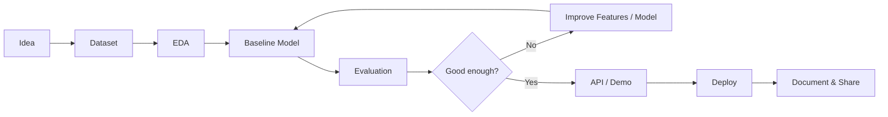

<!--
  GitHub Profile README
  Username: tungtimo0808
  Style: Cute AI Trainer / Pokemon-inspired / Animated
  Put this file at: https://github.com/tungtimo0808/tungtimo0808/blob/main/README.md
-->

<div align="center">


<a href="https://github.com/tungtimo0808">
  
</a>

<br/>


<br/><br/>


</div>

---

## 🎮 AI Trainer Card

<table>
<tr>
<td width="58%">

```yaml
trainer_name: "Timo da Poet"
github: "tungtimo0808"
class: "AI Engineer"
region: "Viet Nam"
main_type:
  - Machine Learning
  - Computer Vision
  - Vision-Language Models
  - OCR
  - Creative AI
current_quest:
  - Build useful AI systems
  - Turn notebooks into products
  - Ship clean demos with real value
battle_style:
  - Fast experiments
  - Practical engineering
  - Clear evaluation
  - Cute but professional portfolio
```

</td>
<td width="42%" align="center">


</td>
</tr>
</table>

---

## 🧬 Skill Evolution Tree

<div align="center">

### Stage 01 — Core Coding


### Stage 02 — AI / ML Lab


### Stage 03 — Product / Deploy


</div>

<table>
<tr>
<td width="33%">

### 🧠 ML
- Classification
- Regression
- Recommendation
- Model evaluation
- Notebook experiments

</td>
<td width="33%">

### 👁️ Vision AI
- OCR pipelines
- VLM workflows
- Deepfake detection
- Object / scene analysis
- Image-to-insight systems

</td>
<td width="33%">

### ⚙️ AI Product
- FastAPI backends
- Supabase / PostgreSQL
- Automation flows
- Admin dashboards
- Deploy-ready demos

</td>
</tr>
</table>

---

## 🐾 Project Pokédex

<div align="center">

| Dex | Project | Type | What it does | Status |
|---:|---|---|---|---|
| #001 | [Vision-Language-Model](https://github.com/tungtimo0808/Vision-Language-Model) | 👁️ Vision AI | Chicken Farm System using Python and vision-language ideas | ⭐ Featured |
| #002 | [Heart-Failure-Prediction](https://github.com/tungtimo0808/Heart-Failure-Prediction) | 🫀 Healthcare ML | Predicts heart failure risk from structured health data | ⭐ Featured |
| #003 | [Project-House-Price-Prediction](https://github.com/tungtimo0808/Project-House-Price-Prediction) | 🏠 Regression | House price prediction with ML workflow | Active |
| #004 | [Project-Food-Recommendation](https://github.com/tungtimo0808/Project-Food-Recommendation) | 🍜 Recommender | Food recommendation system | Active |
| #005 | [Generate_Video-](https://github.com/tungtimo0808/Generate_Video-) | 🎬 Video AI | Extracts a new focused video around one person and one product | Experimental |
| #006 | [generate-video-](https://github.com/tungtimo0808/generate-video-) | 🎥 Creative AI | Video generation / focus workflow | Experimental |
| #007 | [OCR-using-SROIE-](https://github.com/tungtimo0808/OCR-using-SROIE-) | 📄 OCR | OCR using SROIE dataset for fine-tuning tasks | Research |
| #008 | [Deepfake-Detector](https://github.com/tungtimo0808/Deepfake-Detector) | 🛡️ AI Safety | Detects manipulated / deepfake media | Research |
| #009 | [medicine-final](https://github.com/tungtimo0808/medicine-final) | 💊 Medical AI | Medicine-related ML/AI project | Research |
| #010 | [mlmed2026](https://github.com/tungtimo0808/mlmed2026) | 🧪 Medical ML | Medicine in Machine Learning study project | Fork / Study |
| #011 | [aiecos-social-crm](https://github.com/tungtimo0808/aiecos-social-crm) | 🤖 AI CRM | Pancake/Zalo/Facebook → Supabase + Admin UI + MCP server | Product |

</div>

---

## ✨ Featured Battle Cards

<table>
<tr>
<td width="50%">

<a href="https://github.com/tungtimo0808/Vision-Language-Model">
  
</a>

**Why it matters:** vision-language systems are useful when normal computer vision is not enough. This project is positioned as a practical AI vision workflow.

</td>
<td width="50%">

<a href="https://github.com/tungtimo0808/Heart-Failure-Prediction">
  
</a>

**Why it matters:** clean ML prediction projects show data handling, training, evaluation, and explainability mindset.

</td>
</tr>
<tr>
<td width="50%">

<a href="https://github.com/tungtimo0808/Generate_Video-">
  
</a>

**Why it matters:** video AI is a strong creative/product direction, especially for marketing, short-form content, and automation.

</td>
<td width="50%">

<a href="https://github.com/tungtimo0808/OCR-using-SROIE-">
  
</a>

**Why it matters:** OCR is one of the most practical AI pipelines for business documents, receipts, invoices, and structured extraction.

</td>
</tr>
</table>

---

## 🧪 My AI Lab Workflow



<div align="center">


&nbsp;&nbsp;

&nbsp;&nbsp;


</div>

---

## 🏆 GitHub Achievements

<div align="center">


</div>

---

## 📊 Stats Dashboard

<div align="center">


<br/><br/>


<br/><br/>


</div>

---

## 🐍 Contribution Snake Animation

> Phần này sẽ chạy đẹp nhất nếu bạn thêm workflow ở `.github/workflows/snake.yml`.

<div align="center">

<picture>
  <source
    media="(prefers-color-scheme: dark)"
    srcset="https://raw.githubusercontent.com/tungtimo0808/tungtimo0808/output/github-contribution-grid-snake-dark.svg"
  />
  <source
    media="(prefers-color-scheme: light)"
    srcset="https://raw.githubusercontent.com/tungtimo0808/tungtimo0808/output/github-contribution-grid-snake.svg"
  />
  
</picture>

</div>

---

## 🎯 Current Quests

<table>
<tr>
<td width="50%">

### 🔥 Building
- AI video generation / extraction workflows
- Vision-language model demos
- OCR fine-tuning experiments
- AI CRM / automation products
- Deploy-ready landing pages and APIs

</td>
<td width="50%">

### 📚 Leveling up
- Better model evaluation
- Better data pipelines
- FastAPI backend architecture
- Vector DB / RAG systems
- Clean GitHub documentation

</td>
</tr>
</table>

---

## 🗂️ Repository Map

<details open>
<summary><b>Open my project map</b></summary>

```txt
tungtimo0808/
├── AI Vision
│   ├── Vision-Language-Model
│   ├── OCR-using-SROIE-
│   └── Deepfake-Detector
│
├── Machine Learning
│   ├── Heart-Failure-Prediction
│   ├── Project-House-Price-Prediction
│   ├── Project-Food-Recommendation
│   ├── medicine-final
│   └── mlmed2026
│
├── Creative AI
│   ├── Generate_Video-
│   └── generate-video-
│
└── AI Product / Automation
    └── aiecos-social-crm
```

</details>

---

## 💬 Connect with me

<div align="center">

<a href="https://github.com/tungtimo0808">
  
</a>
<a href="https://github.com/tungtimo0808?tab=repositories">
  
</a>
<a href="mailto:keytwelvelab@gmail.com">
  
</a>

<br/><br/>


</div>

---

<div align="center">

### ⭐ Thanks for visiting my AI playground


</div>
